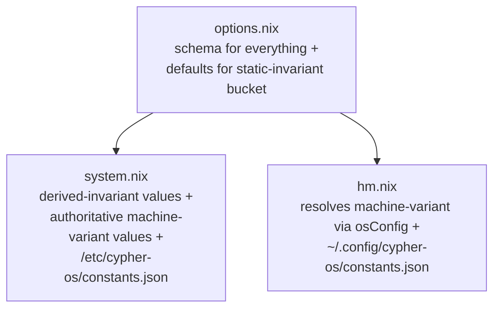

# Convention: Working with `cypher-os.constants.*`

**Status:** Active
**Applies to:** `src/config/constants/{options,system,hm}.nix`
**Related:** [naming.md](./naming.md) (host/machine/lens terminology), [RBK_013](../../project/runbooks/RBK_013_adding_or_updating_a_constant.md), [ADR_023](../../project/decisions/ADR_023_2026_08_22_cypher-os_namespace_and_profile_redesign.md)

---

## 1. Three buckets, sorted by variance

Every constant falls into exactly one of these. Sort a new one into its bucket before writing anything.

- **Static, lens- and machine-invariant** —:
    - same value everywhere, no dependency on another constant.
    - Example: `stateVersion`, `userAvatar`, `defaultWallpaper`.
    - Gets a real `default = ...` directly in `options.nix`.
    - Nothing downstream needs to touch it.
      
- **Derived, lens- and machine-invariant** —:
    - same *formula* everywhere, but the formula references another constant's resolved value, so it can only be computed once `config` exists.
    - Example: `backupRoot` (relative to `homeDirectory`), `obsidianVaultRoot` (relative to `backupRoot`).
    - Lives in `system.nix`'s `config` block.
      
- **Machine-variant** —:
    - may genuinely differ between physical machines, but **must be identical across every lens on the same machine** (see [naming](naming.md)'s host/machine/lens distinction — ***this is not "may differ per `hosts/*` entry"***).
    - Example: `username`, `homeDirectory`, `primaryDisk`.
    - No default in `options.nix`; authoritative value set in `system.nix`; forwarded to HM via `osConfig`.

## 2. Where each bucket lives



`options.nix` — every constant's type + description, plus the literal `default` for the static-invariant bucket *(using the `${self}/...` path pattern where the value is a repo asset — see the note in §3).*

`system.nix` — sets the machine-variant bucket's authoritative values and computes the derived-invariant bucket. Owns `/etc/cypher-os/constants.json`.

`hm.nix` — resolves the machine-variant bucket via the `osConfig ? null` fallback (same shape as `src/profile/hm.nix`), forwards the full resolved set as the `cypherOsConstants` module arg, and owns `~/.config/cypher-os/constants.json`.

## 3. Consuming a constant

Prefer the `cypherOsConstants` module arg over reaching into `config.cypher-os.constants.*` directly, mirroring the `cypherOsProfile`/`cypherOsLens` convention:

```nix
{ cypherOsConstants, ... }:
{
  home.file."Pictures/wallpaper.jpg".source = cypherOsConstants.defaultWallpaper;
}
```

Repo-relative assets (`userAvatar`, `defaultWallpaper`, and similar) are declared using the `${self}/...` path pattern rather than a relative literal — anchored to the repo root via the flake's `self` input, so the reference survives future tree reshuffles regardless of which file declares it.

Requires `self` to be threaded through as a module arg wherever it's used; check `specialArgs` if a new file needs it and doesn't have it yet.

## 4. Two JSON files, two audiences — not duplication

Both `/etc/cypher-os/constants.json` (system.nix) and `~/.config/cypher-os/constants.json` (hm.nix) serialize the exact same resolved `cfg` — no drift risk between the two, since both derive from one eval on the `cypher-nixos` host. They exist for different consumers:

- **`/etc/...`** —:
    - scoped to the NixOS lens's own root subvolume.
    - For root-run scripts and `systemd` units with no reliable `$HOME` to resolve, especially before any user session exists.
      
- **`~/.config/...`** —:
    - The one that's actually cross-lens-visible, because `$HOME` is a shared `subvolume` across every lens on the machine.
    - Generated unconditionally by every lens's HM activation (including the nested `cypher-nixos` host), not gated on `osConfig` — ***this is the genuine single read surface a script running under any lens can rely on.***

## 5. Known risk: machine-variant drift across lenses is not mechanically enforced

Every standalone lens's `home.nix` sets the machine-variant bucket locally (per ADR-024, since there's no `osConfig` to inherit from outside a nested graph).

Nothing today checks that two lenses' independently-set values actually agree — a typo in one lens's `primaryDisk` would silently diverge from another's, even though the architecture requires them to be identical *(same physical disk, same shared home).*

**Mitigation, not yet built:**
- A HM activation-time check comparing this lens's resolved machine-variant values against whatever's already in the shared `~/.config/cypher-os/constants.json` (written by a previous lens's activation), failing loudly on mismatch.
  
- Deliberately a runtime check, not an eval-time file read — reading an external path at eval time requires `--impure`. Tracked as a follow-up, not required to unblock current work.

## 6. Adding or updating a constant

Procedural steps live in [RBK_013](../../project/runbooks/RBK_013_adding_or_updating_a_constant.md) — this doc covers the design reasoning; that runbook covers the mechanical steps.