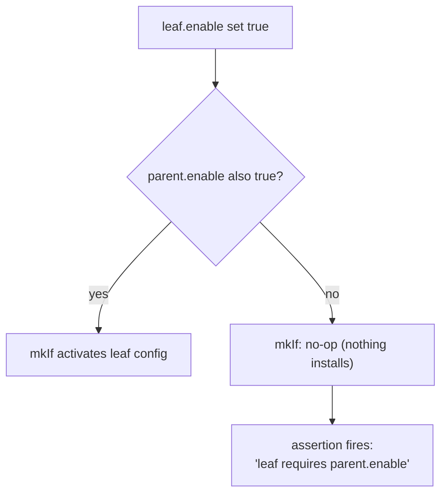

# Convention: Gating, `mkIf`, and Assertions

**Status:** Active
**Applies to:** every `cypher-os.*` category with a toggleable `enable` — `de`, `dm`, `shell`, `security`, `privacy`, `pkgs.{core,cli,utils,dev,devops,browser,editor,terminal,mail,noeta,productivity,gaming,devshells}`, etc.
**Related:** [naming.md](./naming.md), [ADR_023](../../project/decisions/ADR_023_2026_08_22_cypher-os_namespace_and_profile_redesign.md), [ADR_024](../../project/decisions/ADR_024_2026_08_22_cross-context_single_source_of_truth_via_osConfig.md)

---

## 1. Bind `cfg`, don't repeat the path

Any file referencing its own option tree more than twice binds it once:

```nix
let
  cfg = config.cypher-os.pkgs.noeta;
in
```

`cfg` is a read-only convenience binding (`config.cypher-os.<category>`) — useful for *reading* (`cfg.enable`), never for *writing*. `cfg.zsh.enable = lib.mkDefault true;` inside a returned config attrset does not write through to `cypher-os.shell.zsh.enable` — it creates a bogus top-level attribute literally named `cfg`. Always spell out the real path (`cypher-os.<category>.<leaf>.enable = ...;`) on the write side, even in a file where `cfg` is already bound for reads.

## 2. Every category and every leaf gets an `enable`

- Every top-level category gets its own `enable` at the category root, declared in that category's `options.nix`.
- Every leaf inside a togglable category gets its own `enable`, declared alongside its siblings.
- "Ungated baseline" categories (`pkgs.core`) still get a category-level `enable` — **default it `mkDefault true` rather than omitting it.** No category is exempt from having a switch; some just default on.

## 3. The gating pattern: parent AND leaf, always

A leaf's config activates only when **both** its own `enable` and its parent category's `enable` are true — never the leaf alone:

```nix
config = lib.mkMerge [
  (lib.mkIf (cfg.enable && cfg.btop.enable) {
    home.packages = [ pkgs.btop ];
  })

  {
    assertions = [
      {
        assertion = cfg.btop.enable -> cfg.enable;
        message = ''
          cypher-os.pkgs.cli.btop.enable requires cypher-os.pkgs.cli.enable.
        '';
      }
    ];
  }
];
```

Why both `mkIf` *and* an assertion for the same condition:
- `mkIf` alone gives you a silent no-op if someone sets `btop.enable = true` with the parent off — *nothing installs, nothing complains, and that's a worse failure mode than an error, because it looks like nothing is wrong.*
- The assertion converts that silence into a loud, specific failure at eval time.



## 4. `mkIf` vs. assertions — what each is for

- **`mkIf`** — controls whether config *activates*. Every gated block needs one; this is the mechanism, not optional.
- **Assertions** — catch *invalid combinations* with a clear message, instead of a silent no-op or a cryptic Nix error. Use them for:
  - Leaf enabled without its required parent (§3)
  - Mutually exclusive leaves both enabled (§5)
  - A profile/lens mismatch *(e.g. GNOME under `profile.active == "server"`)*
  - A required companion option missing *(e.g. `security.wireshark.enable` needs `security.enable`)*
- Don't write an assertion for something the type system already prevents — `profile.active`'s enum already makes an invalid profile string unrepresentable; no assertion needed there.

## 5. Mutually exclusive leaves (at most one)

For categories where at most one leaf should be true at a time (`dm`: `gdm` vs `sddm`), don't reach for an enum — that fits *exactly-one-required*, not *at-most-one-or-none*. Use an assertion instead:

```nix
let
  enabledDMs = lib.filter (n: cfg.${n}.enable) [ "gdm" "sddm" ];
in
{
  assertions = [
    {
      assertion = lib.length enabledDMs <= 1;
      message = "At most one display manager may be enabled; got: ${toString enabledDMs}";
    }
  ];
}
```

## 6. `mkDefault` vs. plain `=` vs. `mkForce`

- Never hardcode `enable = true;` with plain `=` for anything host-overridable — use `mkDefault` so a host config using plain `=` can still win without needing `mkForce`.
- Reserve `mkForce` for genuine must-win-regardless cases *(a host-level emergency override),* **and comment *why* every time** — it silently defeats every other module's `mkDefault` and plain assignments, which makes it a common source of *"why isn't my override taking effect"* bugs if left unexplained.

## 7. Keep `mkIf` nesting flat

`parent.enable && leaf.enable` in one condition is fine. Nested `mkIf parent (mkIf leaf { ... })` is not — flatten with `&&` inside a single `mkIf` instead of stacking them. If you find yourself wanting three conditions deep, that's usually a sign the leaf needs its own sub-category rather than a deeper nest.

## 8. Standard file shape

```nix
{ config, lib, ... }:
let
  cfg = config.cypher-os.<category>;
in
{
  imports = [ ./options.nix ];

  config = lib.mkMerge [
    (lib.mkIf cfg.enable {
      # main config
    })
    {
      assertions = [ ... ];
    }
  ];
}
```

Assertions sit in their own `mkMerge` branch, unconditional at the file level — conditionality belongs inside each assertion's `->`, never around the whole `assertions` block, so a check is never accidentally skipped by an outer `mkIf`.

## 9. Assertion message style

Name the exact option path(s) involved and state the fix, not just the problem — *established in `src/profile/hm.nix`'s assertions.* A message that only says "invalid configuration" sends you back to the module source to figure out what to change; one that names the path and the fix doesn't.

## 10. Assertions belong to the evaluation graph, not the option — duplicate per graph, not per file

An `assertions` check validates an *option's* invariant, so files that just implement pieces of the same gated option *(e.g. `dconf.nix`, `extensions.nix`, `theming.nix`, `assets.nix` all gating on one category's `cfg.enable`)* never need their own copy — one copy per graph, in whichever file owns that graph's cross-cutting logic, covers every file gating on the same option within that graph.

But `system.nix` and `hm.nix` are two separate `evalModules` calls, each collecting its own `config.assertions` independently — *nothing collected in one is visible to the other.* A category with both a NixOS-side and an HM-side implementation needs the *same* assertion written once in each:

1. **`system.nix`** — the copy that already follows §8's standard shape; reads `config.cypher-os.profile.active` directly, since this graph is the source of truth for that value.

2. **`hm.nix`** — a second copy is required, not optional, covering two concrete failure modes the NixOS-side copy can't catch:
    - The standalone fast-iteration path *(`home-manager build` with no `osConfig` at all, per ADR-024),* and the fact that even nested, HM's activation runs its own independent assertion check as part of applying its generation.

   This copy must resolve the checked value through the `osConfig ? null` fallback, never bare `config.cypher-os.*` — under the nested case, `profile.active` is deliberately *not* independently set in the HM graph (ADR-024), so a bare `config.*` read would break there:

```nix
   { config, lib, osConfig ? null, ... }:

   let
     cfg = config.cypher-os.<category>;
     activeProfile =
       if osConfig != null
       then osConfig.cypher-os.profile.active
       else config.cypher-os.profile.active;
   in
   {
     config = lib.mkMerge = [
         (lib.mkIf cfg.enable {
           # LOGIC HERE
         })

         {
           assertions = [
             {
               assertion = cfg.enable -> activeProfile == "desktop";
               message = ''
                 cypher-os.<category>.enable requires cypher-os.profile.active == "desktop".
               '';
             }
           ];
         }
     ];
   }
```

Same rule for any other cross-context signal from `src/profile/hm.nix`'s `_module.args` (`cypherOsLens`, once consumed) — resolve via the fallback, never bare `config.*`, on the HM side.

## 11. Related angles — not yet specced

Flagging these as things this convention doesn't cover yet; ask if you want any of them written up:

- `mkEnableOption` description text style (e.g. lowercase, no "Whether to enable…" boilerplate)
- `config.warnings` for deprecated-but-not-broken combos, as distinct from `assertions` for broken ones
- `lib.optional`/`lib.optionals` for conditionally including list items, vs. wrapping a whole list in `mkIf` when you're only trimming entries
- `home.packages` vs `environment.systemPackages` placement rules per profile/lens
- preferring the `cypherOsProfile`/`cypherOsLens` `_module.args` over reaching into `config.cypher-os.profile.active` directly, for consistency across category modules going forward
