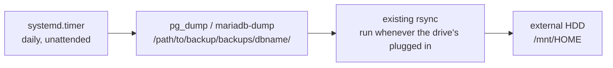

# Backup tooling, mapped onto your actual workflow

I currently *(as of writing this -  2026-08-17)* leverage plain `rsync` for backups *(or rather a complete mirror of my computer drive to an external HDD.)* It is a completely legitimate backup strategy — for my setup *(single machine, single external drive, plug-in-when-on-intervals cadence).* There are dedicated tools that solve problems `rsync` *doesn't* solve well.

## What `rsync` gives you (and what it doesn't)

My current command:
```bash
sudo nice -n -18 rsync -ahAXv --delete --info=progress2 /path/to/source/ /path/to/target/
```

- This is a **mirror**, not a backup history.
- `--delete` means the destination always matches the source exactly — if you delete or corrupt a file on `/source` today and run this command, that file is gone from the external HDD too, forever.
- That's the one real gap:
  - rsync-mirroring protects from *drive failure*, not from *"I deleted the wrong thing and didn't notice for two weeks."*

## What restic/borg add

| | restic | borg |
|---|---|---|
| Core idea | Content-addressed **snapshots over time** — every run creates a new named point-in-time restore target, old ones don't get overwritten | Same core idea, older/more mature project |
| Deduplication | Yes — unchanged data isn't stored twice, even across snapshots | Yes |
| Compression + encryption | Built-in | Built-in |
| Destination flexibility | Local disk, SFTP, S3, Backblaze B2, and more, same tool | Mostly local/SFTP-style destinations |
| Restore a file from "3 backups ago" | `restic restore` targeting an old snapshot ID | `borg extract` similarly |

The practical difference from current `rsync` mirror:
- **history**. With restic/borg, *"I need the version of this file from last Tuesday"* is a normal, supported operation. With a pure `--delete` mirror, it isn't — last Tuesday's version is already overwritten unless you happened to plug in the drive between then and now and it wasn't touched since.

## Is this currently needed?

Considering my current setup — no NAS, no always-available destination, manual plug-in-and-run cadence —:
- **not yet.** restic/borg earn their keep once you have:
  1. a destination that's reachable often enough for scheduled runs to matter, or
  2. a specific *"I wish I could get an old version back"* moment that's actually happened to you.
- Neither is true yet. Retrofitting restic onto my current workflow later is a small, mechanical change (`restic init` on the external drive, then `restic backup /path/to/source` instead of the `rsync` command) — nothing about doing it later costs anything now.

## Where systemd timers fit — and where they don't (yet)

The external HDD is manually plugged in, so a `systemd.timer` scheduling the *rsync-to-external-HDD* step doesn't make sense yet — there's nothing to schedule against, the drive isn't reliably present. Hence, I'll keep doing that step manually.

Where a timer genuinely helps **today**:
- the piece that runs against something that's *always* present — *the machine's internal disk.*
- That's exactly what `modules/devops/databases.nix` does:
  - `pg_dump`/`mariadb-dump` write timestamped, compressed SQL files into `/path/to/data/backup/dir/backups/<db>/` on a daily `systemd.timer`, entirely unattended, no drive required.
  - Because that directory already lives inside `/path/to/data/backup/dir/`, the next time the external HDD is plugged in and rsync command ran, those dumps get swept up automatically — there's no need to change current manual habit at all, but rather just gave it more (and better-structured) material to work with.



That's the whole strategy:
- automate the part that has an always-on target (dumping to local disk), leave the part that has an intermittent target (manual rsync) exactly as it already works well.

## A quick note on retention

Current DBMS backup implementation (`modules/devops/databases.nix`) deletes dump files older than 14 days automatically (`find ... -mtime +14 -delete`), so `/path/to/data/backup/dir/backups/` doesn't grow forever.

That number is arbitrary — tune it as desired; once you have a feel for how often you'd actually reach for a 2-week-old dump versus a 2-day-old one.
