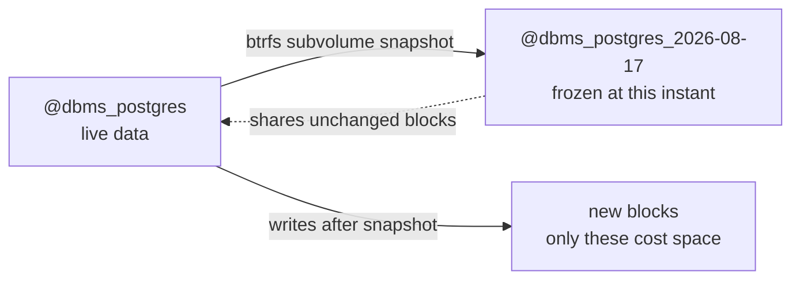

# Btrfs snapshots, for CypherOS

## The core idea

A Btrfs filesystem is a tree of **subvolumes** — each one behaves like an independent filesystem that can be mounted at its own path, but they all share the same underlying storage pool (space is shared, not partitioned). `@home`, `@nix-store`, `@swap`, and now `@dbms_postgres` etc. are all subvolumes, siblings of each other, all living under the invisible top-level subvolume (ID 5) of the physical partition.

A **snapshot** is a subvolume that starts out as an exact copy of another subvolume — but it's *not* a copy in the disk-space sense. Btrfs uses copy-on-write (CoW): the snapshot and the original share all their data blocks until one of them changes. Only the *changed* blocks get duplicated. So creating a snapshot of a 20GB Postgres data directory takes a fraction of a second and close to zero extra disk space, even though it looks like a complete independent copy.



## Explicit vs periodic

The raw `btrfs subvolume snapshot` command is **explicit only** — you type it, it happens once, nothing schedules it for you. There's no built-in daemon.

However, there are purpose-built tools that wrap that raw command in scheduling logic, so "periodic" absolutely exists — it's just a layer on top, not a Btrfs primitive:

| Tool | What it adds |
|---|---|
| **snapper** | The most common on NixOS (`services.snapper`) — timeline snapshots (hourly/daily/weekly), automatic cleanup/retention policies, pre/post snapshot pairs around package upgrades |
| **btrbk** | More backup-oriented — snapshotting *plus* `btrfs send/receive` to another Btrfs filesystem (local or remote), which is the efficient way to replicate snapshots incrementally |

For CypherOS's DBMS use case specifically, a recommendation is starting manual/explicit rather than reaching for snapper immediately:

```bash
# Take one, right before you do something risky (a migration, an upgrade)
sudo btrfs subvolume snapshot -r /dbms/postgres /dbms/.snapshots/postgres_$(date +%Y%m%d-%H%M%S)

# List what you have
sudo btrfs subvolume list /dbms

# Roll back (delete the live one, promote the snapshot)
sudo btrfs subvolume delete /dbms/postgres
sudo btrfs subvolume snapshot /dbms/.snapshots/postgres_20260817-140000 /dbms/postgres
```

The `-r` flag makes it **read-only**, which is what you want for a rollback point — *you don't want to accidentally write into your safety net.*

Adding `services.snapper` comes once this manual habit feels natural and we know what retention policy we actually want/need *(there's no point automating a policy not yet lived).*

## Why this complements, not replaces, DBMS-native dumps

| | Btrfs snapshot | `pg_dump`/`mariadb-dump` |
|---|---|---|
| Speed | Near-instant | Takes as long as the data takes to serialize |
| Space cost | ~0 until data diverges | Full logical size, compressed |
| Portability | Btrfs-to-Btrfs only (needs `send`/`receive` to move) | Plain SQL — works on any filesystem, any machine, any Postgres/MariaDB version within reason |
| Best for | "Undo my last schema migration," fast local rollback during active dev | Actual disaster recovery, moving data off this machine, restoring to a machine with zero Btrfs history |
| Crash-consistency | Depends on the DB's own on-disk state at the instant of snapshot — a Postgres snapshot mid-write is still crash-consistent (same guarantee as a hard power-off, which Postgres's WAL is designed to survive), but not as clean as a proper `pg_dump` | Always logically consistent — it's a coherent SQL representation, not a filesystem-level freeze-frame |

Practically:
- snapshot before you do something you might regret in a dev session *(cheap, fast, local undo button).*
-  Let the daily `pg_dump`/`mariadb-dump` timers *(see `docs/project/guide_backup_tooling.md`)* be the thing that actually leaves the machine, via your existing external-HDD rsync habit.

## One Btrfs-specific gotcha for your setup

Never mount a subvolume *inside* another already-mounted subvolume's directory tree *(this is exactly what caused the earlier `@data`-inside-`@home` incident — see the `scripts/mount.sh` comments).*

Keep every subvolume you care about as a **top-level sibling**, mounted directly off `subvolid=5`. That's why `/dbms/postgres`, `/dbms/mariadb`, etc. sit at the same tier as `/home` and `/nix`, not nested inside any of them.
