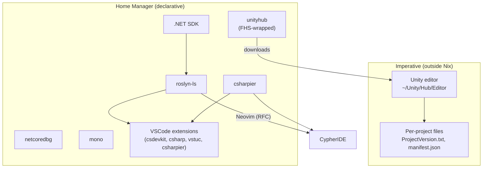

# Game Development Tooling (Unity + C#) Setup

- Covers the `cypher-os.pkgs.dev.gameDev` module, the VSCode integration, and the decisions behind both.
- Neovim support is specified separately in `CypherIDE/docs/project/rfcs/RFC_NNN_neovim_unity_csharp_support.md`.

**RELATED:**
- ADR(s):
    1. [ADR_025_2026_09_29_unity_6000.3_lts_editor_pin](../../project/decisions/ADR_025_2026_09_29_unity_6000.3_lts_editor_pin.md)
    2. [ADR_026_2026_09_29_share_roslyn_ls_and_csharpier_across_vscode_and_neovim](../../project/decisions/ADR_026_2026_09_29_share_roslyn_ls_and_csharpier_across_vscode_and_neovim.md)
    3. [ADR_027_2026_09_29_use_separate_debuggers_for_plain_Csharp_and_unity](../../project/decisions/ADR_027_2026_09_29_use_separate_debuggers_for_plain_Csharp_and_unity.md)
- Runbook(s):
    1. [RBK_017_setting_up_a_new_unity_project](../../project/runbooks/RBK_017_setting_up_a_new_unity_project.md)
- Session Journal: [2026_09_29_game_dev_tooling](../../../../../development/journal/2026_09_29_game_dev_tooling.md)
- Neovim RFC: `CypherIDE/docs/rfcs/RFC_NNN_neovim_unity_csharp_support.md`

---

## 1. Scope and constraints

- **"Purpose":** Triggered by a Game Design and Development Course in Uni, using Unity and C#. Not aiming for production-grade tooling.
- **Preference:** everything Home Manager managed, unless it cannot be.
- **Convention:** both IDEs share the same language server, formatter and *(where possible)* debugger binaries.
- **Unity version:** the course does not restrict it, so a stable LTS is pinned.

---

## 2. Architecture



The split matters:
- Nix provides the tools, while the Unity editor and per-project configuration stay imperative and live in the project *(committed to git).*

---

## 3. Decisions

| #   | Decision                                                                                                                                | Reasoning                                                                                                                                                                                                                                             |
| --- | --------------------------------------------------------------------------------------------------------------------------------------- | ----------------------------------------------------------------------------------------------------------------------------------------------------------------------------------------------------------------------------------------------------- |
| 1   | Pin Unity **6000.3 LTS**                                                                                                                | - Supported until December 2027. 6000.0 LTS ends October 2026.<br>- 6000.6+ crashes on project open under the nixpkgs FHS wrapper (NixOS/nixpkgs#561247).<br>- 6000.3 has not been confirmed to work; no failure report was found either.             |
| 2   | Use `unityhub` from `nixpkgs`                                                                                                           | - Unity supports only FHS Linux; `nixpkgs` wraps the Hub in an FHS env. <br>- Editors it downloads are not Nix-managed.                                                                                                                               |
| 3   | Drop `alcom`, `assetripper`, `daggerfall-unity*`, `libunity`, `libappindicator*`, `diodon`, `plasma-hud`, `openseeface`, `plasticscm-*` | - Unrelated to the course: VRChat tooling, asset extraction, a game built on Unity, Ubuntu Unity _desktop_ components, face tracking, or an alternative VCS *(git + git-lfs is used instead).*<br>- `unity-test` was not verified; assumed unrelated. |
| 4   | Keep the VSCode Unity extension (`vstuc`)                                                                                               | - No competing extension with equivalent Unity debugging was found. <br>- It is Microsoft proprietary and tied to Microsoft's VS Code build (not VSCodium), which is recorded in a comment block in the source.                                       |
| 5   | Language server: Roslyn LS on both IDEs                                                                                                 | - Same server as C# Dev Kit; `nixpkgs` packages it as `roslyn-ls`.<br>- Avoids legacy OmniSharp and Mason-downloaded binaries.                                                                                                                        |
| 6   | Formatter: `csharpier` on both IDEs                                                                                                     | Single shared binary.                                                                                                                                                                                                                                 |
| 7   | Two debuggers, not one                                                                                                                  | - Unity runs on Mono and debugs over the Mono soft debugger; netcoredbg targets .NET (CoreCLR).<br>- The convention of a shared debugger cannot be fully met.                                                                                         |
| 8   | Enforce git-lfs with an assertion                                                                                                       | - Unity projects track large binary assets; a checkout without LFS silently yields pointer files.                                                                                                                                                     |
| 9   | Set `DOTNET_CLI_TELEMETRY_OPTOUT=1`                                                                                                     | Privacy-first default.                                                                                                                                                                                                                                |
| 10  | Skip IntelliCode for C#                                                                                                                 | Optional; not needed for the course. C# Dev Kit may still pull it in as a dependency.                                                                                                                                                                 |

---

## 4. Option tree

```text
cypher-os.pkgs.dev.gameDev
├── enable
├── gui.enable                 # gates Unity Hub (desktop only)
├── unity.enable               # unityhub
├── dotnet.enable              # SDK, roslyn-ls, csharpier
├── dotnet.sdk                 # default: dotnetCorePackages.sdk_9_0 (placeholder choice)
└── debug
    ├── netcoredbg.enable
    └── mono.enable
```

VSCode options to add to `src/pkgs/dev/ide/vscode/options.nix`:

```nix

extensions.lang.csharp.enable = lib.mkEnableOption "C# support (C# Dev Kit, CSharpier)";
extensions.gameDev.unity.enable = lib.mkEnableOption "Unity support (Microsoft Unity extension)";
```

## 5. File map

| File                                                    | Purpose                                                            |
| ------------------------------------------------------- | ------------------------------------------------------------------ |
| `src/pkgs/dev/game_dev/options.nix`                     | Option tree                                                        |
| `src/pkgs/dev/game_dev/hm.nix`                          | Entry point; imports leaves; shared assertions including `git-lfs` |
| `src/pkgs/dev/game_dev/unity.nix`                       | Unity Hub (desktop + gui)                                          |
| `src/pkgs/dev/game_dev/dotnet.nix`                      | SDK, roslyn-ls, csharpier, env vars                                |
| `src/pkgs/dev/game_dev/debug.nix`                       | netcoredbg, mono                                                   |
| `src/pkgs/dev/ide/vscode/extensions/lang/csharp.nix`    | VSCode C# support                                                  |
| `src/pkgs/dev/ide/vscode/extensions/game_dev/unity.nix` | VSCode Unity support                                               |

## 6. Unity workflow (not declarative)

1. Launch `unityhub` and sign in. **Note:** the Hub requires a Unity account, and Unity Editor/Hub telemetry is not controlled by this module.
2. Install the **6000.3 LTS** editor from the Hub.
3. New projects: commit `ProjectSettings/ProjectVersion.txt` and `Packages/manifest.json`; these are the declarative parts of a Unity project.
4. Set the external script editor in Unity: Edit → Preferences → External Tools.
5. Regenerate project files from Unity after adding scripts, so the language server sees them.

## 7. Known gaps and risks

- The editor and Hub-managed downloads are imperative.
- Unity debugging in Neovim is unresolved (see the RFC).
- The Nix-provided `DOTNET_ROOT` value and the `dotnetAcquisitionExtension.existingDotnetPath` setting name are unverified.
- The `roslyn-ls` SDK requirement is unverified; `sdk_9_0` is a placeholder.
- Reported `nixpkgs` issues to re-check on the channel in use:
    - C# Dev Kit not finding the runtime (#389351),
    - debugger not found (#449679),
    - roslyn-ls read-only cache folder (#376199).
- `vscMkt.csharpier.csharpier-vscode` is assumed to be the correct attribute path, and how the extension locates the `csharpier` binary has not been checked.
- Unity Hub 6000.6+ crash (#561247) applies only if the editor is not pinned to 6000.3.

## 8. Verification checklist

- [ ] `nix flake check` and a Home Manager build succeed.
- [ ] `dotnet --info` reports the expected SDK; `echo $DOTNET_ROOT` and `ls $DOTNET_ROOT` look right.
- [ ] `command -v Microsoft.CodeAnalysis.LanguageServer`, `csharpier --version`, `netcoredbg --version`, `mono --version` resolve.
- [ ] `unityhub` starts; the 6000.3 LTS editor installs and opens a new 2D or 3D project.
- [ ] VSCode: opening a Unity script activates C# Dev Kit and the Unity extension without runtime errors; formatting on save uses CSharpier.
- [ ] VSCode Unity debugging attaches to the editor.
- [ ] The `git-lfs` assertion fires when `programs.git.lfs.enable` is false.

## 9. References

- [nixpkgs unityhub package](https://github.com/NixOS/nixpkgs/blob/2230a20f2b5a14f2db3d7f13a2dc3c22517e790b/pkgs/development/tools/unityhub/default.nix)
- [Unity 6000.6+ crash on NixOS (#561247)](https://github.com/NixOS/nixpkgs/issues/561247)
- [Unity 6 releases and support](https://unity.com/releases/unity-6)
- [Unity and ALCOM on NixOS home-manager (gist)](https://gist.github.com/nil-vr/09f6ebf470701d007553cf0de7c2c3ee)
- [vstuc in nixpkgs](https://mynixos.com/nixpkgs/package/vscode-extensions.visualstudiotoolsforunity.vstuc)
- [ms-dotnettools set in nixpkgs](https://mynixos.com/nixpkgs/packages/vscode-extensions.ms-dotnettools)
- [Unity extension announcement and licensing](https://devblogs.microsoft.com/visualstudio/announcing-the-unity-extension-for-visual-studio-code/)
- [VSCodium extensions and proprietary debugger note](https://github.com/VSCodium/vscodium/blob/master/docs/index.md)
- [C# Dev Kit runtime issue (#389351)](https://github.com/NixOS/nixpkgs/issues/389351)
- [C# Dev Kit debugger issue (#449679)](https://github.com/NixOS/nixpkgs/issues/449679)
- [roslyn-ls cache folder issue (#376199)](https://github.com/NixOS/nixpkgs/issues/376199)
- [NixOS Wiki: DotNET](https://wiki.nixos.org/wiki/DotNET)
- [nixpkgs dotnet manual](https://github.com/NixOS/nixpkgs/blob/master/doc/languages-frameworks/dotnet.section.md)
- [roslyn.nvim (seblj)](https://github.com/seblj/roslyn.nvim)
- [walcht/neovim-unity](https://github.com/walcht/neovim-unity)
- [unity-dap (Unity Mono debug adapter)](https://github.com/overlooked-being/unity-dap)
- [apyra/nvim-unity](https://github.com/apyra/nvim-unity) and [nvim-unity-sync](https://github.com/apyra/nvim-unity-sync)
- [nvim-dap adapter installation wiki](https://github.com/mfussenegger/nvim-dap/wiki/Debug-Adapter-installation)